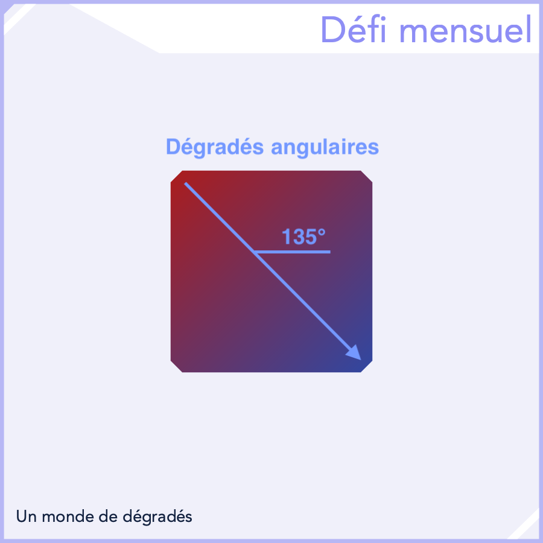

## Défi Mensuel - Octobre 2024

```
Difficulté : 4/4 Expert
Catégories : Maths, Images, Géométrie, Figures, Trigonométrie, Vecteurs, Produit Scalaire, Gestion de Matrices
```

> *Réaliser une fonction permettant de générer un **dégradé de 2 couleurs** suivant un **angle aléatoire***.


