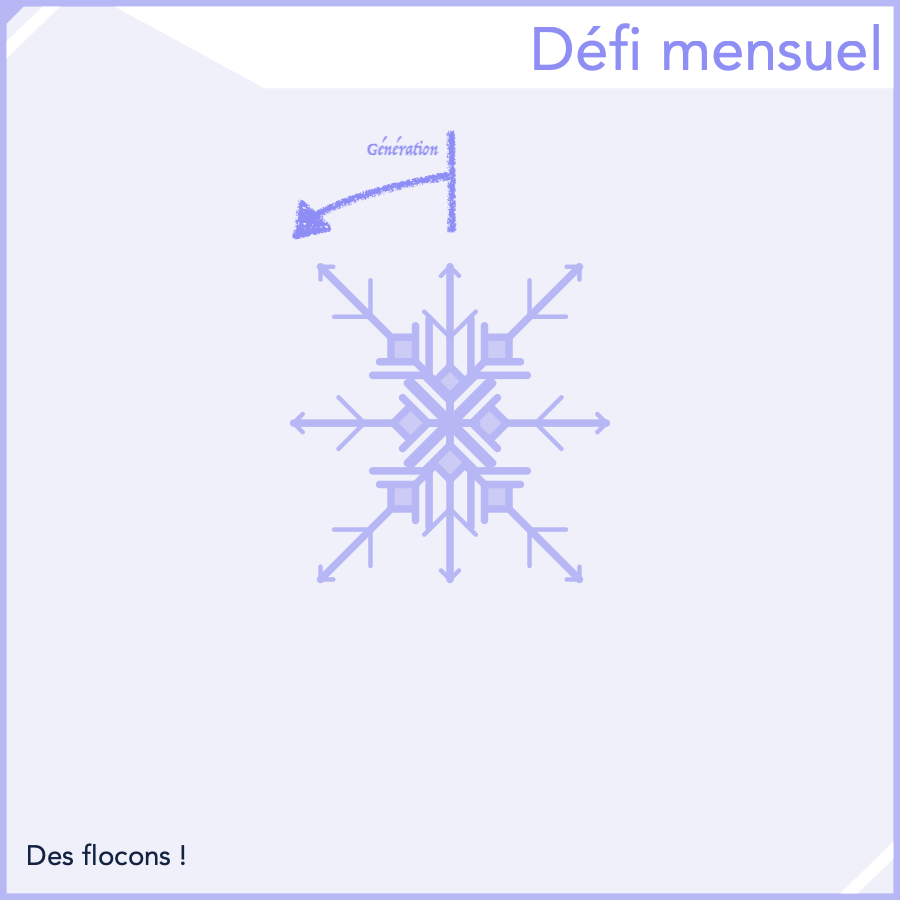

## Défi Mensuel - Décembre 2024

```
Difficulté : 2/4 Intermédiaire
Catégories : Maths, Fractalles, Géométrie, Boucles, Interface
```
> *Réalisez un programme permettant à l'utilisateur de **générer des flocons** de manière **aléatoire** (ou paramètrée)*.


