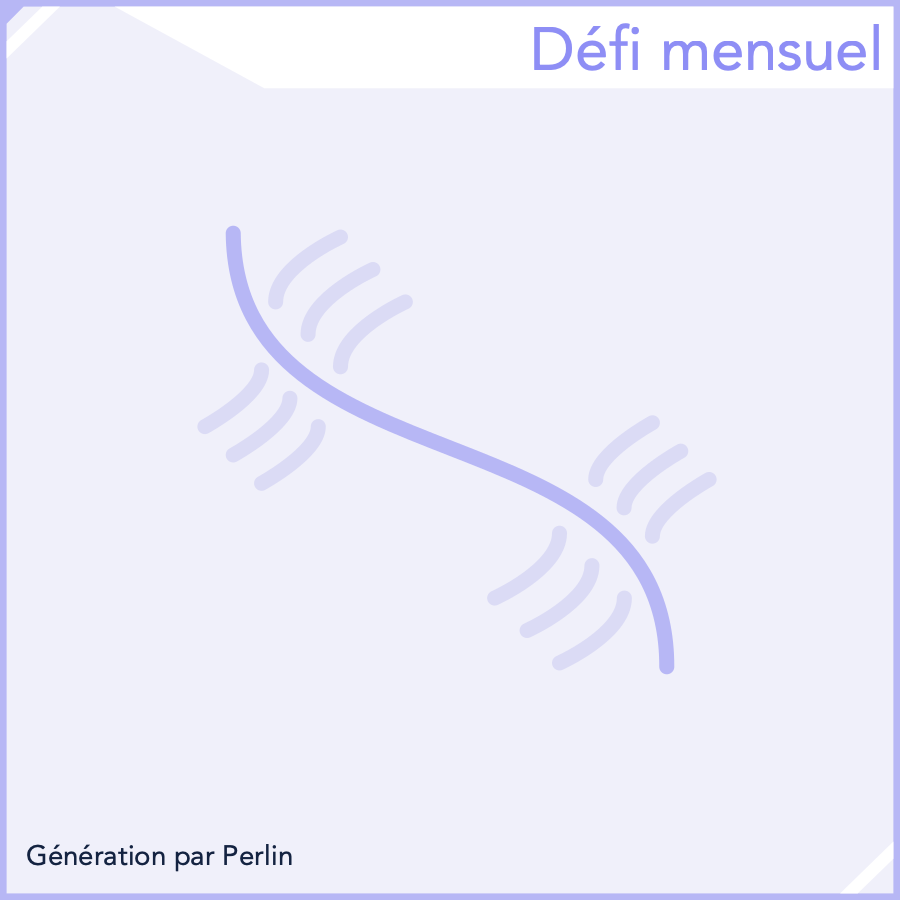

## Défi Mensuel - Avril 2025

```
Difficulté : 1/4 Basique
Catégories : Mathématiques, Arts, Géométrie, Procédures, Aléatoire, Bruit de Perlin
```
> *Réaliser un **générateur d'art procédural aléatoire**, sur Scratch ou adacraft (extension *Bruit de Perlin* recommandée)*.


