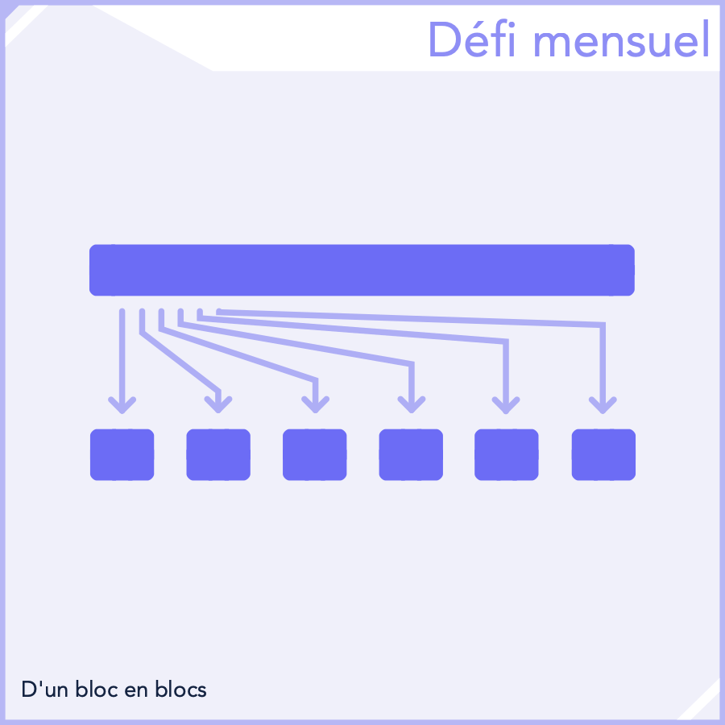

## Défi Mensuel - Mai 2025

```
Difficulté : 1/4 Basique
Catégories : Séquences, Itération, Listes, Fonctions, Paramètrage
```
> *Réaliser un bloc personnalisé permettant de **séparer une chaîne de caractère** en **paquets** d'une **longueur prédéfinie** et les sauvegardant dans une liste.*.


