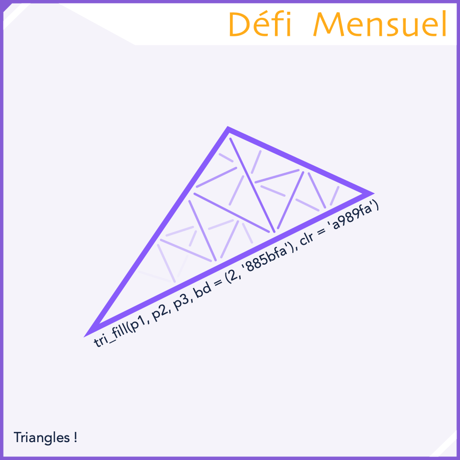

## Défi Mensuel - Juillet 2025

```
Difficulté : 4/4 Expert
Catégories : Mathématiques, Géométrie, Procédures, Affichage, Stylo
```
> *Réaliser une **fonction** permettant de **remplir un triangle** de manière précise et optimisée (sans toutefois être parfaite)*.


