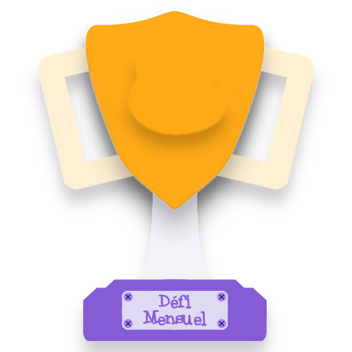

#  Défi Mensuel - Foire Aux Questions

## Qu'est-ce que le « Défi Mensuel » ?

Le **«  Défi Mensuel »** est un **challenge de code** proposé _chaque mois_ aux membres de la **Communauté Scratch Francophone Discord**.

### Quand est-il proposé ?

Comme son nom l'indique, un défi est proposé par mois.  
Posté en général le premier week-end du mois, le défi mensuel est disponible jusqu'à la publication de sa solution.

### Qui peut participer ?

N'importe qui peut participer au défi mensuel, mais certains d'entre eux sont complexes et requièrent des conaissances avancées, vues au Collège voire au Lycée, sans toutefois monter plus haut.
Ainsi, pour les défis les plus difficiles, un ou des indices peuvent être diffusés pendant le mois dédié au défi, de même, pour les plus simples, une suggestion pour aller plus loin peut être proposée.

### Dans quel langage coder ?

N'importe lequel ! Si le but du Défi Mensuel est de vous faire découvrir de nouveaux aspects de Scratch, libre à vous de créer le script demandé dans n'importe quel language de programmation.
Notez toutefois qu'il n'y a pas forcément de correction pour d'autres langages.

### Y-a t-il des corrections ou une solution ?

Oui, l'Équipe du Serveur propose des *solutions* dans divers langage, de manière générale en Scratch 3.0 (`.sb3`), plus, parfois, dans les langages suivants : 
Oui, *à minima* en Scratch, plus, parfois :
- en python `.py` (un langage par ligne de code orienté objet, très simple à utiliser) ;
- en ruby `.rb` (un langage par ligne de code orienté objet, ressemblant plus à Scratch mais légèremebt plus complexe à utiliser).

Les solutions sont publiées généralement la première semaine du mois suivant celui dédié au défi sur le serveur, et à partir de cette date dans ce répertoire.
Toutefois, les solutions Scratch (`.sb3`) ne seront pas publiées ici, ainsi, si nous ne publions pas d'autre solution que celle au format Scratch, il n'y aura pas de solution sur GitHub.

## Participer au « Défi Mensuel »

Nous vous invitons fortement à participer aux défis à votre portée, c'est un excellent moyen de progresser en programmation.

Pour participer, assurez-vous d'être sur [notre serveur Discord](https://discord.gg/UnjbyEEVak). Les défis sont proposés sur ce répertoire GitHub généralement en même temps que les solutions sont publiées sur le serveur.  
Si vous êtes sur le serveur et que vous partagez votre projet (sur ce dernier), même incorrect, vous recevrez une récompense.

----

